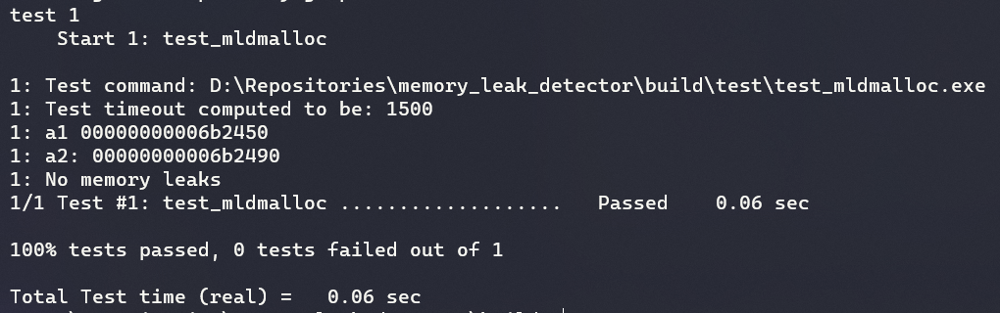
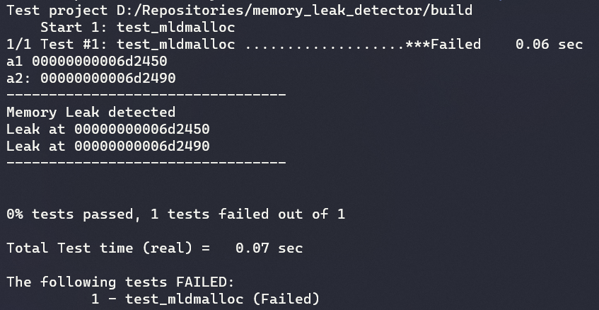

- [memory_leak_detector](#memory_leak_detector)
- [Building](#building)
- [Testing](#testing)
  - [No memory leak test](#no-memory-leak-test)
  - [Memory leak test](#memory-leak-test)
- [Checklist](#checklist)

# memory_leak_detector

Detect memory leaks in C by wrapping raw `malloc` and `free` APIs

- Keeps track of allocated memory using generic linked list

# Building

```cmake
cmake -B build -G Ninja
```

# Testing

- [x] Tested with GCC (10.2) and MSVC (16.8.2) compiler on Windows
- [ ] Tested with GCC (9.3) compiler compiler on Linux

## No memory leak test

```bash
# Enter the build folder
cd build

# Build the project
cmake --build .

# Run the test
ctest -V --output-on-failure
```



## Memory leak test

- Modify `test/test_mldmalloc.c`
- Allocate memory using `mld_malloc` and do not `mld_free`
- Run the above commands for default testing

```bash
# Enter the build folder
cd build

# Build the project
cmake --build .

# Run the test
ctest --output-on-failure
```



# Checklist

- [x] Location (pointer) of memory leak
- [ ] Data size of memory leak
- [ ] Unit-Testing
- [ ] Code coverage
- [ ] CI/CD
